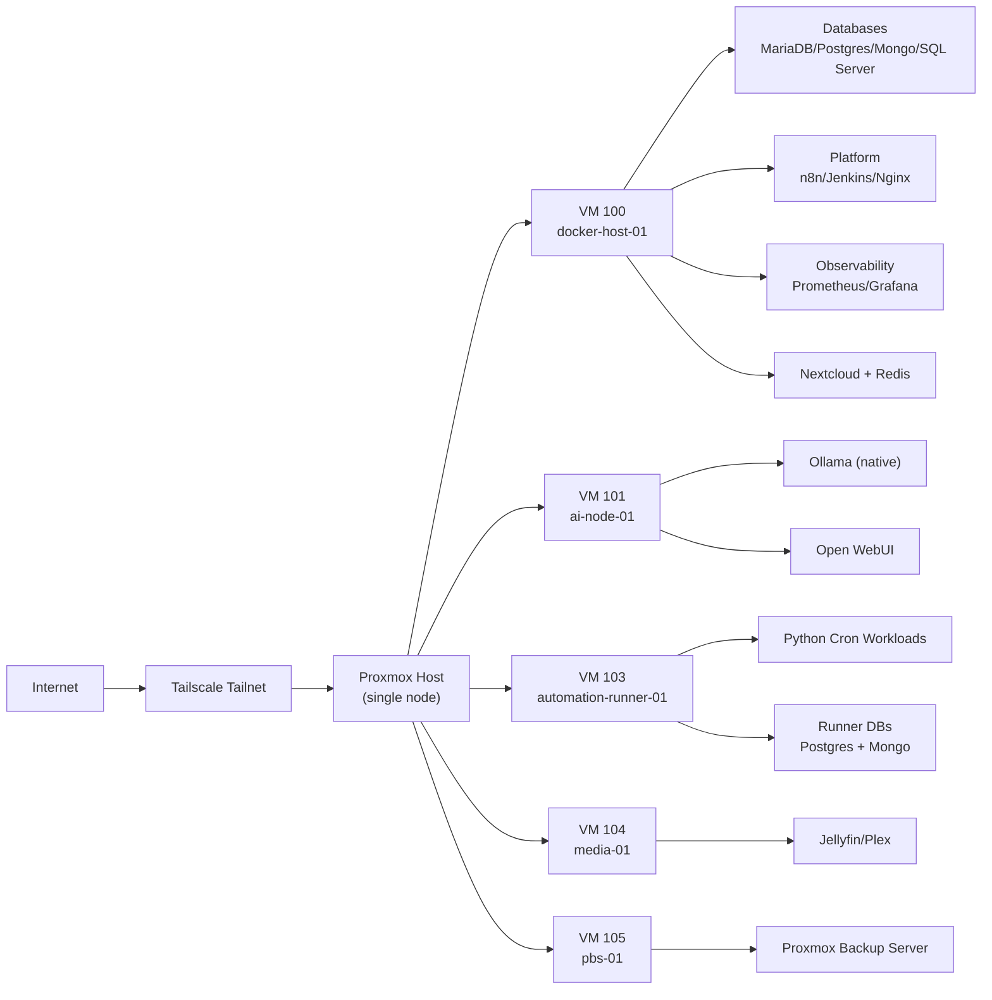
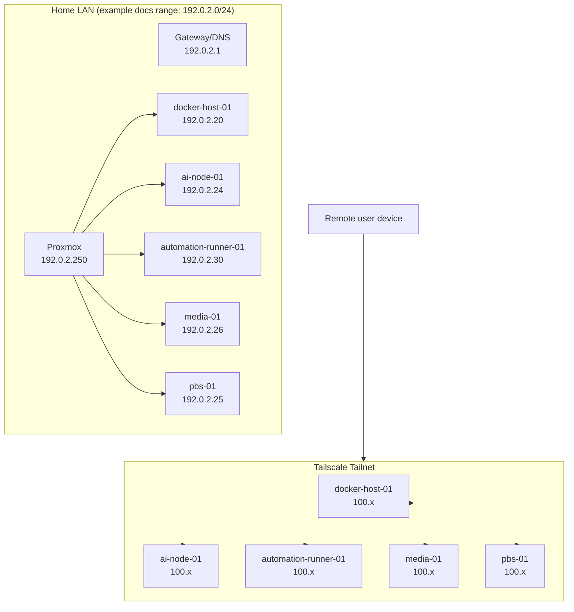
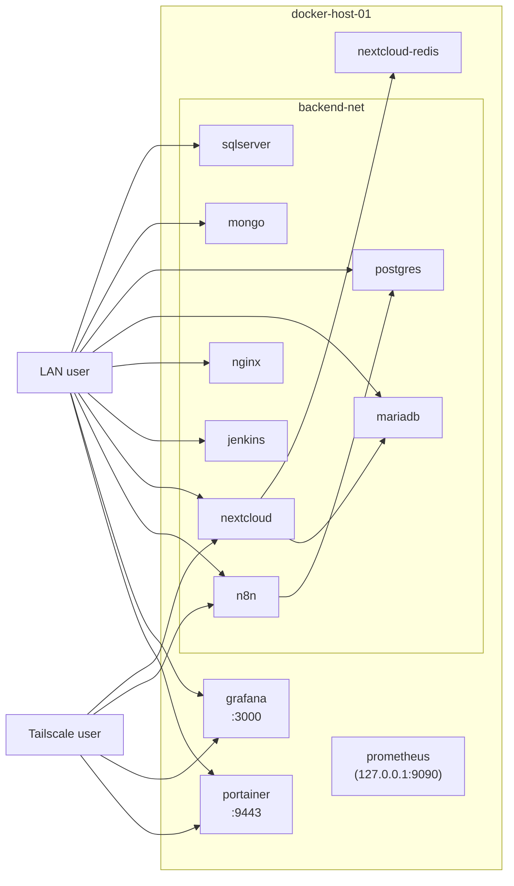
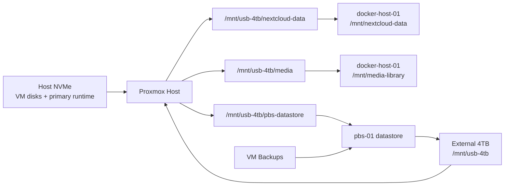

# Visual Diagrams

## 1) High-Level Architecture

```mermaid
flowchart LR
  Internet["Internet"] --> Tailnet["Tailscale Tailnet"]
  Tailnet --> PVE["Proxmox Host\n(single node)"]

  PVE --> VM100["VM 100\ndocker-host-01"]
  PVE --> VM101["VM 101\nai-node-01"]
  PVE --> VM103["VM 103\nautomation-runner-01"]
  PVE --> VM104["VM 104\nmedia-01"]
  PVE --> VM105["VM 105\npbs-01"]

  VM100 --> CDB["Databases\nMariaDB/Postgres/Mongo/SQL Server"]
  VM100 --> CPLAT["Platform\nn8n/Jenkins/Nginx"]
  VM100 --> COBS["Observability\nPrometheus/Grafana"]
  VM100 --> CNC["Nextcloud + Redis"]

  VM101 --> OLL["Ollama (native)"]
  VM101 --> WEBUI["Open WebUI"]

  VM103 --> RUNNER["Python Cron Workloads"]
  VM103 --> ARDB["Runner DBs\nPostgres + Mongo"]

  VM104 --> JF["Jellyfin/Plex"]
  VM105 --> PBS["Proxmox Backup Server"]
```

## 2) Network and Access Model

```mermaid
flowchart TB
  subgraph LAN["Home LAN (example docs range: 192.0.2.0/24)"]
    GW["Gateway/DNS\n192.0.2.1"]
    PVE["Proxmox\n192.0.2.250"]
    DKR["docker-host-01\n192.0.2.20"]
    AI["ai-node-01\n192.0.2.24"]
    RUN["automation-runner-01\n192.0.2.30"]
    MED["media-01\n192.0.2.26"]
    PBS["pbs-01\n192.0.2.25"]
  end

  subgraph TS["Tailscale Tailnet"]
    T1["docker-host-01\n100.x"]
    T2["ai-node-01\n100.x"]
    T3["automation-runner-01\n100.x"]
    T4["media-01\n100.x"]
    T5["pbs-01\n100.x"]
  end

  User["Remote user device"] --> TS
  TS --> T1
  TS --> T2
  TS --> T3
  TS --> T4
  TS --> T5

  PVE --> DKR
  PVE --> AI
  PVE --> RUN
  PVE --> MED
  PVE --> PBS
```

## 3) Docker Host Internal Connectivity

```mermaid
flowchart LR
  subgraph VM100["docker-host-01"]
    subgraph NET["backend-net"]
      MAR["mariadb"]
      PG["postgres"]
      MON["mongo"]
      MSSQL["sqlserver"]
      N8N["n8n"]
      JEN["jenkins"]
      NGX["nginx"]
      NC["nextcloud"]
    end

    REDIS["nextcloud-redis"]
    PROM["prometheus\n(127.0.0.1:9090)"]
    GRAF["grafana\n:3000"]
    PORT["portainer\n:9443"]
  end

  N8N --> PG
  NC --> MAR
  NC --> REDIS

  UserLAN["LAN user"] --> PORT
  UserLAN --> GRAF
  UserLAN --> N8N
  UserLAN --> NC
  UserLAN --> JEN
  UserLAN --> NGX
  UserLAN --> MAR
  UserLAN --> PG
  UserLAN --> MON
  UserLAN --> MSSQL

  UserTS["Tailscale user"] --> PORT
  UserTS --> GRAF
  UserTS --> N8N
  UserTS --> NC
```

## 4) Storage and Backup Flow

```mermaid
flowchart LR
  NVME["Host NVMe\nVM disks + primary runtime"] --> PVE["Proxmox Host"]
  USB["External 4TB\n/mnt/usb-4tb"] --> PVE

  PVE --> NFS1["/mnt/usb-4tb/nextcloud-data"]
  PVE --> NFS2["/mnt/usb-4tb/media"]
  PVE --> NFS3["/mnt/usb-4tb/pbs-datastore"]

  NFS1 --> DKR["docker-host-01\n/mnt/nextcloud-data"]
  NFS2 --> DKR2["docker-host-01\n/mnt/media-library"]
  NFS3 --> PBS["pbs-01 datastore"]

  VMS["VM Backups"] --> PBS
  PBS --> USB
```
